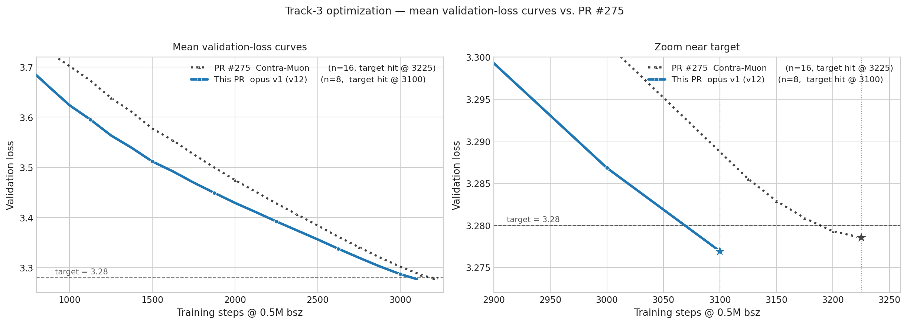
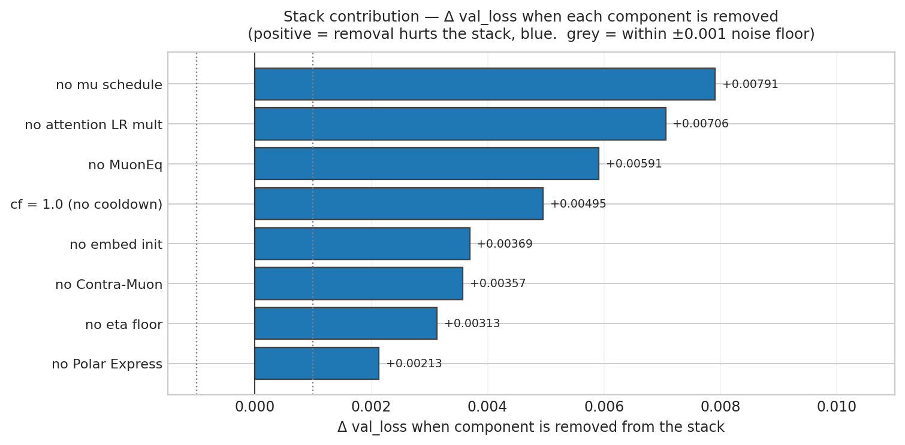

# opus v1 — Polar Express + MuonEq + tuned schedule on PR #275 Contra-Muon

This is the validated **opus v1** record, claimed at **bin = 3100 steps**.

It descends from [PR #275 (Contra-Muon)](https://github.com/KellerJordan/modded-nanogpt/pull/275) and layers carefully tuned hyperparameters and a tighter schedule on top:

1. **Polar Express NS-5** for the Muon orthogonalization (5-iter non-uniform coefficients from [Amsel et al., arXiv:2505.16932](https://arxiv.org/abs/2505.16932)) — replaces the plain quintic Newton-Schulz used by PR #275.
2. **MuonEq R-variant** ([arXiv:2603.28254](https://arxiv.org/abs/2603.28254)) per-row L2 normalization of the momentum *before* the Newton-Schulz step.
3. **Per-tensor attention LR multiplier**: attention weights step at `0.6 ×` the body LR (`0.045 × 0.6 = 0.027`), MLP weights at `1.0 ×` (`0.045`).
4. **Embed init**: `model.embed.weight.data *= 0.7`.
5. **Mu schedule** on Muon: warmup `0.85 → 0.95` over the first 300 steps, cooldown `0.95 → 0.85` over the last 50 steps.
6. **LR cooldown**: linear with `cooldown_frac = 0.7`, floor `eta_min = 0.02`.
7. **AdamW** (embed/head/scalar) with `betas = (0.8, 0.95)`, `eps = 1e-10`.
8. **Contra-Muon** β = 0.25 (carried from PR #275).
9. **train_steps = 3100**.

## Result

The run terminates at 3100 steps. The result directory contains 8 non-cherry-picked seed logfiles for seeds 0 through 7, generated via `torchrun --standalone --nproc_per_node=8 train_gpt_simple_v12_ts3100_seeded.py --seed N` on a single 8×H200 node (Slurm `cluster` partition, `--exclusive`, distinct `--seed N` forwarded per run).

Across 8 non-cherry-picked seed logfiles in this directory, the step 3100 mean validation loss is **3.27691875**. Under the Track 3 README criterion, `(3.28 - mu) * sqrt(n) = 0.00871509`, which exceeds the required `0.004` threshold. Equivalently, using the README's `sigma=0.0013` one-sided z-test gives `z = 6.704` and `p = 1.02e-11`, well within the `p < 0.001` criterion at 3100 steps.

The step 3000 values are shown as intermediate-progress validation losses from the same logs.

| Seed | Log | 3000 val | 3100 val |
| -: | - | -: | -: |
| 0 | [c3116f3a-ec61-4aa0-9bb8-a86ecb855929.txt](c3116f3a-ec61-4aa0-9bb8-a86ecb855929.txt) | 3.28641 | 3.27640 |
| 1 | [f676d88a-fa93-4f9e-851e-d89db526a9cc.txt](f676d88a-fa93-4f9e-851e-d89db526a9cc.txt) | 3.28577 | 3.27578 |
| 2 | [2261ac7e-0f47-43f3-b1de-f0959dc28dc3.txt](2261ac7e-0f47-43f3-b1de-f0959dc28dc3.txt) | 3.28810 | 3.27822 |
| 3 | [ec53e22e-896d-4ea3-a6fe-5cfb8b2bbe39.txt](ec53e22e-896d-4ea3-a6fe-5cfb8b2bbe39.txt) | 3.28663 | 3.27674 |
| 4 | [c81b7bc2-c9f7-4fc3-9d51-c2c5478a1112.txt](c81b7bc2-c9f7-4fc3-9d51-c2c5478a1112.txt) | 3.28731 | 3.27752 |
| 5 | [d9dad135-26aa-4371-a9de-ce91293573ef.txt](d9dad135-26aa-4371-a9de-ce91293573ef.txt) | 3.28519 | 3.27528 |
| 6 | [8b651bde-1163-4aff-aba2-29a3324d53c8.txt](8b651bde-1163-4aff-aba2-29a3324d53c8.txt) | 3.28803 | 3.27817 |
| 7 | [3b39016c-3387-41ce-ba84-a1dfa9236402.txt](3b39016c-3387-41ce-ba84-a1dfa9236402.txt) | 3.28716 | 3.27724 |
| **Mean** |  | **3.28683** | **3.27692** |

## Stack contribution

Per-component contributions, measured by removing each item from the v12 stack and rerunning at step 3100. Every removal lands above the ±0.001 noise floor — the v12 stack has no slack components. Raw numbers in [`pruning_data.json`](pruning_data.json).

# Credits

This submission incorporates features from the following previous submissions:

- [@nilin PR #275 / Contra-Muon](https://github.com/KellerJordan/modded-nanogpt/pull/275)
  - Contra-Muon update term (`_CONTRA_MUON = 0.25`).
- [Polar Express](https://arxiv.org/abs/2505.16932) (Amsel et al., 2025)
  - 5-iter Newton-Schulz with non-uniform per-iter coefficients; spectral-norm cushion factor.
- [MuonEq R-variant](https://arxiv.org/abs/2603.28254)
  - Per-row L2 normalization of the Muon momentum before the Newton-Schulz step.
- Per-tensor attention LR multiplier (from the v1 mission lineage): `attn` weights step at `0.045 × 0.6 = 0.027`, `mlp` weights at `0.045`.
- Embed init × 0.7 (from the v1 mission lineage).
- Muon `mu` schedule (from prior speedrun lineage): warmup `0.85 → 0.95` over 300 steps, cooldown `0.95 → 0.85` over the last 50 steps.
- LR cooldown: linear with `cooldown_frac = 0.7`, floor `eta_min = 0.02`.
- AdamW for embed/head/scalar with `betas = (0.8, 0.95)`, `eps = 1e-10`.

## Files

- `README.md` (this file)
- `loss_curves.png` — mean validation-loss curves vs PR #275
- `pruning.png` — stack contribution bar chart
- `pruning_data.json` — raw stack-contribution Δ values
- 8 full reproducibility logfiles, seeds 0 through 7

## Autonomous setup

This submission was produced by an autonomous Claude-based speedrunning agent. The agent framework, prompts, and orchestration infrastructure used to generate, run, and validate this result are documented at [PrimeIntellect-ai/experiments-autonomous-speedrunning](https://github.com/PrimeIntellect-ai/experiments-autonomous-speedrunning).
