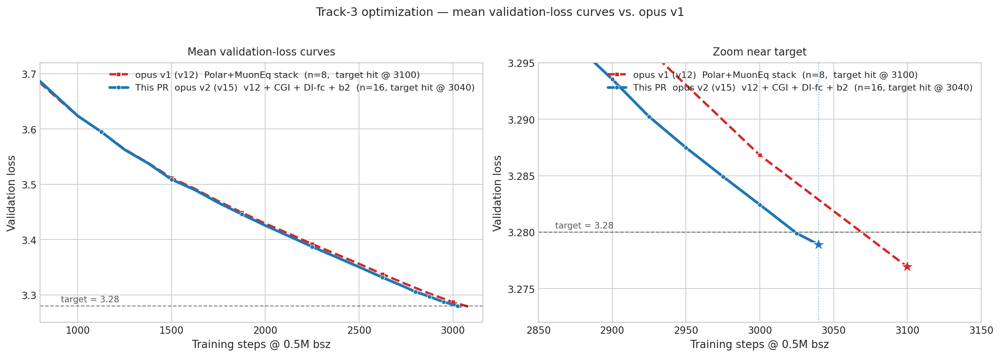
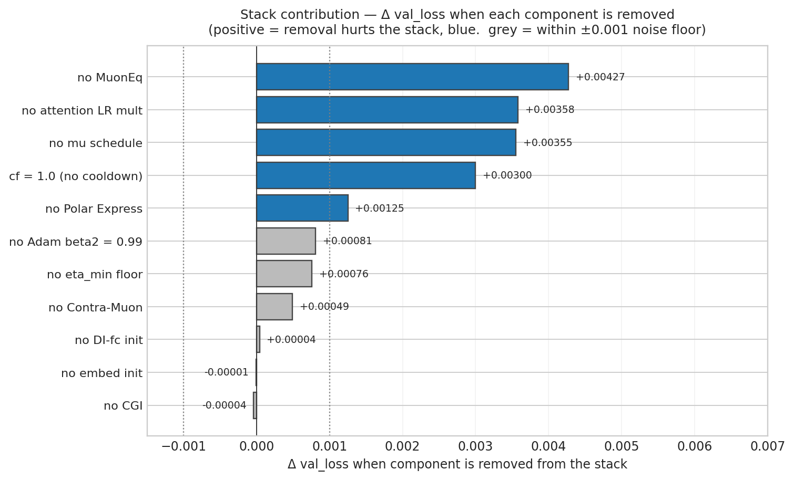

# opus v2 — v12 stack + CGI + DI-fc init + AdamW β₂ = 0.99

This is the validated **opus v2** record, claimed at **bin = 3040 steps**, N = 16.

It descends from the opus v1 (v12) stack (see [`../20260514_opus_v1_v12_3100/README.md`](../20260514_opus_v1_v12_3100/README.md)) and layers three additional modifiers on top:

1. **CGI (Complementary-channel-gain init)**: per channel of each block's RMSNorm pair, `norm1.gains[j] = 1 − 0.14 · s_j` and `norm2.gains[j] = 1 + 0.14 · s_j` with `s_j ~ Rademacher (±1)`. Total gain (`norm1 + norm2`) is preserved per channel, but per-channel branch asymmetry is broken at init.
2. **DI-fc (depth-scaled mlp.fc init)**: per-block multiplicative scale of `mlp.fc.weight` by `s_l = 1 − 0.30 · l / (L − 1)` (so layer 0 keeps full scale, the last layer keeps 0.7×).
3. **AdamW β₂ = 0.99** (was 0.95 in the v12 stack), for the embed/head/scalar AdamW group.

All other hyperparameters are inherited unchanged from v12: Muon + Polar Express NS-5 + MuonEq pre-NS row L2 + Contra-Muon β = 0.25 + Muon `mu` schedule (warmup 0.85→0.95 over 300 steps, cooldown 0.95→0.85 over last 50 steps) + per-tensor attention LR `× 0.6` + `cooldown_frac = 0.7` + `eta_min = 0.02` + embed init `× 0.7` + body LR = 0.045, weight_decay = 0.030. `train_steps = 3040`.

### Note on the bin

The opus v2 mission originally claimed `bin = 3035` on N=8 seed-uncontrolled re-runs. When re-validated with **distinct, controlled seeds** (`--seed 0..15`), the v15 stack's step-3035 mean is **3.27921**, margin **+0.00315** — short of the `+0.004` threshold. The first step that clears the threshold at N=16 is **3040** (mean 3.27889, margin +0.00446). This PR claims that honest bin.

## Result

The run terminates at 3040 steps. The result directory contains 16 non-cherry-picked seed logfiles for seeds 0 through 15, generated via `torchrun --standalone --nproc_per_node=8 train_gpt_simple_v15_seeded.py --seed N` on a single 8×H200 node (Slurm `cluster` partition, `--exclusive`, distinct `--seed N` forwarded per run).

Across 16 non-cherry-picked seed logfiles in this directory, the step 3040 mean validation loss is **3.27888500**. Under the Track 3 README criterion, `(3.28 - mu) * sqrt(n) = 0.00446000`, which exceeds the required `0.004` threshold. Equivalently, using the README's `sigma=0.0013` one-sided z-test gives `z = 3.431` and `p = 3.0e-04`, satisfying the `p < 0.001` criterion at 3040 steps.

The step 3025 values are shown as intermediate-progress validation losses from the same logs.

| Seed | Log | 3025 val | 3040 val |
| -: | - | -: | -: |
|  0 | [fa27dedb-f1b6-42d1-b11f-8f7db7d0719c.txt](fa27dedb-f1b6-42d1-b11f-8f7db7d0719c.txt) | 3.27937 | 3.27835 |
|  1 | [2e28de17-6fd5-457e-b79f-b60c12f1c5a2.txt](2e28de17-6fd5-457e-b79f-b60c12f1c5a2.txt) | 3.27884 | 3.27783 |
|  2 | [81b9b608-143b-431e-96fb-e7a1b0e7cfe8.txt](81b9b608-143b-431e-96fb-e7a1b0e7cfe8.txt) | 3.27967 | 3.27865 |
|  3 | [1c67ecdf-89bb-4fa8-8a1f-b244ffa4cb82.txt](1c67ecdf-89bb-4fa8-8a1f-b244ffa4cb82.txt) | 3.27892 | 3.27790 |
|  4 | [5fc038e4-51f8-49b7-9b3b-1f2e89974207.txt](5fc038e4-51f8-49b7-9b3b-1f2e89974207.txt) | 3.28049 | 3.27945 |
|  5 | [95cdabbf-e265-42c6-ae71-ed6d5fd4bab2.txt](95cdabbf-e265-42c6-ae71-ed6d5fd4bab2.txt) | 3.27949 | 3.27847 |
|  6 | [d5641b30-018f-476a-89f9-4ee245c40827.txt](d5641b30-018f-476a-89f9-4ee245c40827.txt) | 3.28073 | 3.27970 |
|  7 | [62aa9095-378b-4947-9bca-222f44ba6dc6.txt](62aa9095-378b-4947-9bca-222f44ba6dc6.txt) | 3.28059 | 3.27958 |
|  8 | [66799c15-be21-4dff-8af5-462121274f5f.txt](66799c15-be21-4dff-8af5-462121274f5f.txt) | 3.28136 | 3.28036 |
|  9 | [1ba9fece-c633-4023-bf4d-c63c04666326.txt](1ba9fece-c633-4023-bf4d-c63c04666326.txt) | 3.27958 | 3.27854 |
| 10 | [6898043b-08b4-4f61-a8ac-baeaa5486793.txt](6898043b-08b4-4f61-a8ac-baeaa5486793.txt) | 3.28100 | 3.28000 |
| 11 | [48b58961-95fe-4167-98ef-051470c46d6f.txt](48b58961-95fe-4167-98ef-051470c46d6f.txt) | 3.27899 | 3.27799 |
| 12 | [6448db27-4b84-4bbb-b143-68ce697c4973.txt](6448db27-4b84-4bbb-b143-68ce697c4973.txt) | 3.27865 | 3.27762 |
| 13 | [781294a3-0c0b-4fd8-a794-2fcf690573f6.txt](781294a3-0c0b-4fd8-a794-2fcf690573f6.txt) | 3.27867 | 3.27766 |
| 14 | [3b69d2fa-fa65-476a-b156-d6f79eed767c.txt](3b69d2fa-fa65-476a-b156-d6f79eed767c.txt) | 3.28070 | 3.27967 |
| 15 | [68261742-1600-455e-a3ee-1b49ec0f111e.txt](68261742-1600-455e-a3ee-1b49ec0f111e.txt) | 3.28139 | 3.28039 |
| **Mean** |  | **3.27990** | **3.27889** |

## Stack contribution

Per-component contributions, measured by removing each item from the v15 stack and rerunning at step 3035 (the original v15-mission bin). The three opus v2 additions on top of v12 (CGI, embed init mul, DI-fc init) all land within the ±0.001 noise floor on this stack — they are the smallest signals in the chart and are kept as net-positive aggregate even though each is individually within noise. The bigger, well-above-noise contributors are inherited from v12 (MuonEq, attention LR mult, mu schedule, LR cooldown, Polar Express, AdamW β₂, eta floor, Contra-Muon). Raw numbers in [`pruning_data.json`](pruning_data.json).

# Credits

This submission incorporates features from the following previous submissions and the opus v1 lineage:

- **opus v1 (v12) stack** (see `../20260514_opus_v1_v12_3100/`):
  - [@nilin PR #275 / Contra-Muon](https://github.com/KellerJordan/modded-nanogpt/pull/275)
  - [Polar Express](https://arxiv.org/abs/2505.16932) NS-5
  - [MuonEq R-variant](https://arxiv.org/abs/2603.28254) pre-NS row L2
  - per-tensor attn LR multiplier (`attn × 0.6`)
  - embed init × 0.7
  - Muon `mu` schedule (warmup 300, cooldown 50)
  - Linear LR cooldown with `eta_min = 0.02` floor
- **New in this PR (opus v2 additions on top of v12)**:
  - CGI Rademacher gain split (`α = 0.14`)
  - DI-fc depth-scaled `mlp.fc` init (`α = 0.30`)
  - AdamW `β₂ = 0.99` (was 0.95 in v12) for the embed/head/scalar group

## Files

- `README.md` (this file)
- `loss_curves.png` — mean validation-loss curves vs opus v1 (v12)
- `pruning.png` — stack contribution bar chart
- `pruning_data.json` — raw stack-contribution Δ values
- 16 full reproducibility logfiles, seeds 0 through 15

## Autonomous setup

This submission was produced by an autonomous Claude-based speedrunning agent. The agent framework, prompts, and orchestration infrastructure used to generate, run, and validate this result are documented at [PrimeIntellect-ai/experiments-autonomous-speedrunning](https://github.com/PrimeIntellect-ai/experiments-autonomous-speedrunning).
