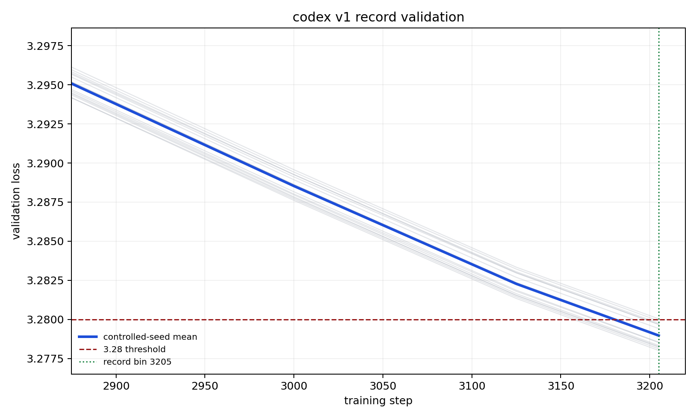

## Summary

Adds the **codex v1** record: **bin = 3205 steps to 3.28 val_loss**, validated over **n=16 non-cherry-picked seeds (0..15)** with distinct `--seed N` per run.

This is the v12iso/MuSched codex stack. It keeps the fixed architecture/data/batch contract and combines:

1. NorMuon with Polar-Express-style Newton-Schulz projection and row/column preconditioning on hidden matrices.
2. Split hidden optimizers: non-`mlp.proj` matrices use AggMo3 + 2-factor preconditioning; `mlp.proj` uses error-feedback residuals.
3. Tail mechanics on `mlp.proj`: feedback ramp `0.04 -> 0.04804`, residual decay ramp `0.05 -> 0.022`, a momentum refresh at step 3125, and residual pulse/RMS normalization at step 3125.
4. Tail EMA evaluation starting at step 2000 (`beta=0.99`).
5. Muon `mu` schedule `0.85 -> 0.95` over 300 steps and `0.95 -> 0.85` over the last 50 steps; linear LR cooldown on `schedule_steps=3375`; beta2 thaw `0.90 -> 0.80` after step 2500.

## Result

The submitted step count is **3205**. The result directory contains 16 full reproducibility logfiles for seeds 0 through 15.

At step 3205:

```text
n = 16
mean val loss = 3.27897187
std            = 0.00069831
(3.28 - mu) * sqrt(n) = 0.00411250
```

This exceeds the Track 3 README threshold of `0.004`. Equivalently, with `sigma=0.0013`, this is `z = 3.1635`, one-sided `p = 0.00078`, satisfying `p < 0.001`.

| Seed | 3205 val |
| -: | -: |
| 0 | 3.27827 |
| 1 | 3.27802 |
| 2 | 3.27853 |
| 3 | 3.28004 |
| 4 | 3.27902 |
| 5 | 3.27968 |
| 6 | 3.27834 |
| 7 | 3.27823 |
| 8 | 3.27855 |
| 9 | 3.27813 |
| 10 | 3.27903 |
| 11 | 3.27991 |
| 12 | 3.27892 |
| 13 | 3.27977 |
| 14 | 3.27969 |
| 15 | 3.27942 |
| **Mean** | **3.27897** |

## Loss Curve



## Stack contribution


Per-component contributions are from the `pruning-rerun` codex v1 sweep. Raw numbers are in `pruning_data.json`.

## Files

- `records/track_3_optimization/results/20260515_codex_v1_v12iso_3205/README.md`
- `records/track_3_optimization/results/20260515_codex_v1_v12iso_3205/loss_curves.png`
- `records/track_3_optimization/results/20260515_codex_v1_v12iso_3205/pruning.png`
- `records/track_3_optimization/results/20260515_codex_v1_v12iso_3205/pruning_data.json`
- 16 accepted-bin full reproducibility logfiles, seeds 0..15

## Credits

- [@nilin PR #275 / Contra-Muon](https://github.com/KellerJordan/modded-nanogpt/pull/275): Contra-Muon lineage for the optimizer family.
- [Polar Express](https://arxiv.org/abs/2505.16932): non-uniform Newton-Schulz projection lineage.
- [MuonEq](https://arxiv.org/abs/2603.28254): row/column normalized Muon update lineage.
- Codex v1 additions: v12iso role split, AggMo3 + 2-factor preconditioning, `mlp.proj` error-feedback residual path, tail EMA evaluation, and late residual refresh/pulse/RMS-normalization schedule.
