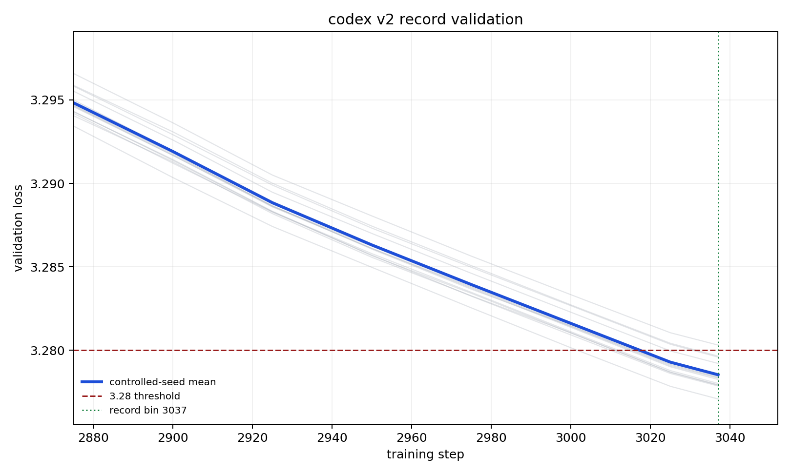

## Summary

Adds the **codex v2 legal** record: **bin = 3037 steps to 3.28 val_loss**, validated over **n=16 non-cherry-picked seeds (0..15)** with distinct `--seed N` per run.

This descends from the v12 optimizer stack but keeps the Track 3 architecture block compliant after the legal rebuild. The winning recipe layers:

1. Polar Express NS-5 + MuonEq row-normalized update.
2. Role-specific Muon LR multipliers: q/k `0.61875`, v `0.625`, attn.proj `0.6375`, mlp.fc `1.0125`, mlp.proj `0.9875` of base LR `0.045`.
3. Role-specific weight decay around `0.027..0.0315` instead of one body-wide value.
4. Muon lookahead from step 2450, interval 25, alpha 0.35, pull 0.15, with a 150-step smoothstep ramp.
5. Embed init `* 0.7`, AdamW betas `(0.8, 0.95)`, `eta_min=0.02`, and the `0.85 -> 0.95 -> 0.85` Muon schedule.

## Result

The submitted step count is **3037**. The result directory contains 16 full reproducibility logfiles for seeds 0 through 15.

At step 3037:

```text
n = 16
mean val loss = 3.27853000
std            = 0.00080602
(3.28 - mu) * sqrt(n) = 0.00588000
```

This exceeds the Track 3 README threshold of `0.004`. Equivalently, with `sigma=0.0013`, this is `z = 4.5231`, one-sided `p = 3.05e-06`, satisfying `p < 0.001`.

| Seed | 3037 val |
| -: | -: |
| 0 | 3.27825 |
| 1 | 3.27850 |
| 2 | 3.27921 |
| 3 | 3.27833 |
| 4 | 3.27836 |
| 5 | 3.27708 |
| 6 | 3.28031 |
| 7 | 3.27841 |
| 8 | 3.27860 |
| 9 | 3.27786 |
| 10 | 3.27959 |
| 11 | 3.27801 |
| 12 | 3.27791 |
| 13 | 3.27793 |
| 14 | 3.27965 |
| 15 | 3.27848 |
| **Mean** | **3.27853** |

## Loss Curve



## Stack contribution


Per-component contributions are from the `pruning-rerun` codex v2 legal sweep at step 3037. Lookahead and role LR/WD are the main v2-specific additions; MuonEq and the Muon schedule remain the largest inherited contributors. Raw numbers are in `pruning_data.json`.

## Files

- `records/track_3_optimization/results/20260515_codex_v2_legal_3037/README.md`
- `records/track_3_optimization/results/20260515_codex_v2_legal_3037/loss_curves.png`
- `records/track_3_optimization/results/20260515_codex_v2_legal_3037/pruning.png`
- `records/track_3_optimization/results/20260515_codex_v2_legal_3037/pruning_data.json`
- 16 full reproducibility logfiles, seeds 0..15

## Credits

- [@nilin PR #275 / Contra-Muon](https://github.com/KellerJordan/modded-nanogpt/pull/275): Contra-Muon shaping lineage.
- [Polar Express](https://arxiv.org/abs/2505.16932) NS-5 and [MuonEq](https://arxiv.org/abs/2603.28254) row-normalized Muon update.
- Codex v2 additions: compliant v12 rebuild, role-specific LR/WD, and Muon lookahead.
