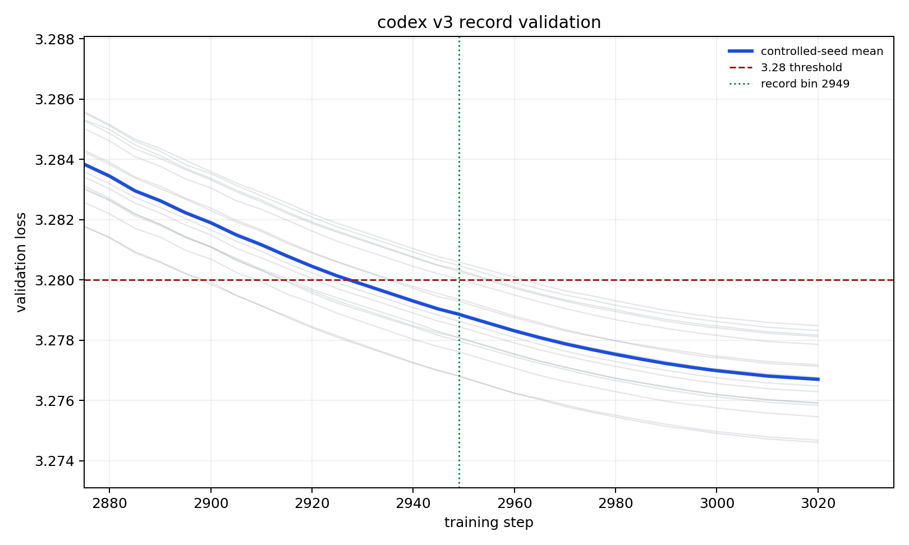
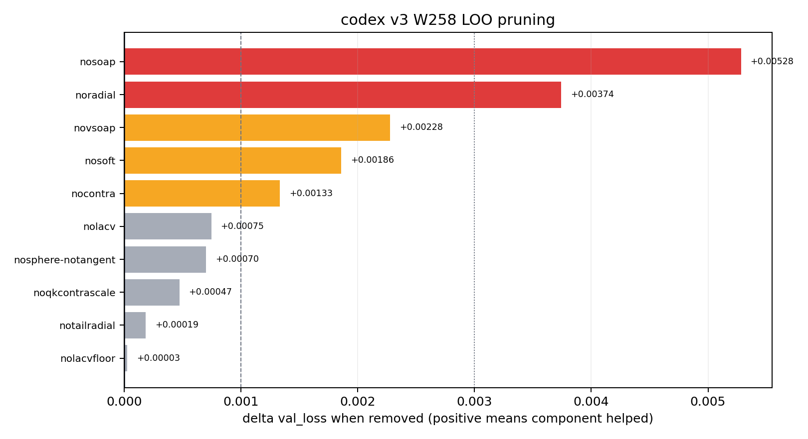

## Summary

Adds the **codex v3** record: **bin = 2949 steps to 3.28 val_loss**, validated over **n=16 non-cherry-picked seeds (0..15)** with distinct `--seed N` per run.

This stack starts from the public PR #291/#294 lineage and compresses it with codex W258 pruning. It keeps the fixed architecture/data/batch contract and uses:

1. PR #291 Contra -> normal -> Soft-Muon schedule with `SOFT_MUON_CEIL=0.75`, Soft ramp ending at step 2905, and q/k Contra residual scaled to `0.125`.
2. PR #294-style radial control: base outward scale `0.45`, tail guard active `2775..2895`, tail outward scale `0.38`, with radius correction after the update.
3. MLP+V SOAP preconditioning (`SOAP_PARAM_MODE=mlp_plus_v`), V SOAP blend `0.95`, attention trust floor/cap, and attention SOAP fade `2850..3020`.
4. LACV q/k floor relaxation (`lambda=0.060`, ramp `2550..2900`, fade `2949..3020`) and lookahead-CV gating on q/k/mlp.proj.
5. CGI gain split (`alpha=0.14`), depth-scaled `mlp.fc` init (`alpha=0.30`), zero-init proj weights, embed init `* 0.7`, and PR #287 power-law cooldown constants with `train_steps=3020`, `schedule_steps=3025`.
6. W258 pruning choice: the sphere-lookahead pull is disabled (`SPHERE_LOOKAHEAD_PULL=0.0`), hence the submitted `nosphere` stack.

## Result

The submitted step count is **2949**. The result directory contains 16 full reproducibility logfiles for seeds 0 through 15. The runs continue to `train_steps=3020`, but the submitted bin is the logged step-2949 checkpoint, matching the same intermediate-checkpoint style as the existing PR #1 on this fork.

At step 2949:

```text
n = 16
mean val loss = 3.27886125
std            = 0.00125939
(3.28 - mu) * sqrt(n) = 0.00455500
```

This exceeds the Track 3 README threshold of `0.004`. Equivalently, with `sigma=0.0013`, this is `z = 3.5038`, one-sided `p = 0.000229`, satisfying `p < 0.001`.

| Seed | 2949 val | 3020 val |
| -: | -: | -: |
| 0 | 3.27809 | 3.27591 |
| 1 | 3.27936 | 3.27718 |
| 2 | 3.27863 | 3.27648 |
| 3 | 3.27889 | 3.27677 |
| 4 | 3.28034 | 3.27817 |
| 5 | 3.27808 | 3.27592 |
| 6 | 3.27846 | 3.27629 |
| 7 | 3.27681 | 3.27461 |
| 8 | 3.28060 | 3.27848 |
| 9 | 3.27930 | 3.27713 |
| 10 | 3.27798 | 3.27584 |
| 11 | 3.28048 | 3.27832 |
| 12 | 3.28003 | 3.27786 |
| 13 | 3.27682 | 3.27468 |
| 14 | 3.27762 | 3.27546 |
| 15 | 3.28029 | 3.27812 |
| **Mean** | **3.27886** | **3.27670** |

## Loss Curve



## Stack contribution



Per-component contributions are from the W258 leave-one-out sweep at step 2949. Raw numbers are in `pruning_data.json`.

## Files

- `records/track_3_optimization/results/20260515_codex_v3_nosphere_2949/README.md`
- `records/track_3_optimization/results/20260515_codex_v3_nosphere_2949/loss_curves.png`
- `records/track_3_optimization/results/20260515_codex_v3_nosphere_2949/pruning.png`
- `records/track_3_optimization/results/20260515_codex_v3_nosphere_2949/pruning_data.json`
- 16 full reproducibility logfiles, seeds 0..15

## Credits

- [@nilin PR #291 / Contra-Muon -> Soft-Muon](https://github.com/KellerJordan/modded-nanogpt/pull/291): Soft-Muon schedule and Gram-Frobenius/Schatten-4 input norm lineage.
- [@nilin PR #294 / radial brake](https://github.com/KellerJordan/modded-nanogpt/pull/294): outward radial dampening and post-step radius correction.
- [@samacqua PR #278 / MLP SOAP](https://github.com/KellerJordan/modded-nanogpt/pull/278): SOAP machinery extended here to MLP+V.
- [@yash-oai PR #287 / power-law LR schedule](https://github.com/KellerJordan/modded-nanogpt/pull/287): power-law cooldown constants.
- Codex v3 additions: q/k Contra scaling, LACV q/k floor, lookahead-CV gating, W258 no-sphere pruning, and the 2949 checkpoint compression.
